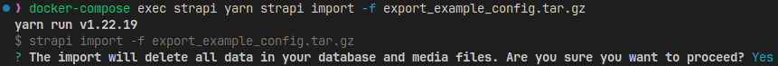
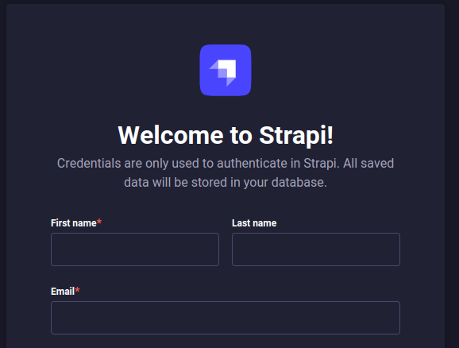

# Lokalhelfer

Lokalhelfer ist die Plattform für Nachbarschaftshilfe von nebenan.

Über die Lokalhelfer-Plattform können Personen geolokalisiert Hilfe bei bestimmten Tätigkeiten
anbieten. Personen, die wiederum Hilfe benötigen, können die Hilfsangebote über die Plattform
anfragen und sich miteinander vernetzen.

Die Plattform bringt Menschen aus gleichen Regionen und Nachbarschaften über ein smartes,
geolokalisiertes Matchmaking zusammen.

Sowohl das Onboarding als Helfer:in sowie die Anfrage als Hilfesuchende Person sind vollständig
automatisiert und im Sinne der Barrierefreiheit leicht zu bedienen. Um das Vertrauen auf der
Plattform zu gewährleisten, kann ein individueller Freigabeprozess für Hilfsangebote aktiviert
werden, welcher die manuelle Freigabe von Hilfsangeboten über das Plattform-Backend ermöglicht.

Sowohl die angebotenen Hilfstätigkeiten sowie deren Clusterungen können individuell gestaltet
werden. Nutzer der Plattform werden Schritt für Schritt durch den Prozess geführt und können alle
Informationen selbstständig im Nachhinein über ein Benutzerkonto verwalten.

Lokalhelfer is the platform for neighborhood help from next door.

Via the Lokalhelfer platform, people can offer geolocalized help with specific activities. People who need help in turn can request it via the platform and network with each other.
The platform brings people from the same regions and neighborhoods together via smart, geolocated matchmaking.
Both the onboarding as a helper and the request as a person seeking help are fully automated and easy to use in terms of accessibility. To ensure trust on the platform, an individual approval process for help offers can be activated which enables the manual approval of help offers via the platform backend.
Both, the help activities offered and their clustering can be customized. Users of the platform are guided through the process step by step and can manage all information independently afterwards via a user account.


Kommunen, Länder, Städte sowie öffentliche und wohltätige Institutionen können die Lokalhelfer
Plattform nahtlos in ihre bestehenden Plattformen und Lösungen integrieren, so dass sie ein
integraler Bestandteil der digitalen Strategie sind. Diese Integrationsmöglichkeit wird durch die API-first Konzeption gewährleistet.

Local governments, states, cities, and public and charitable institutions can integrate the Local Helpers platform seamlessly into their existing platforms and solutions, making it an integral part of their digital strategy. This integration capability is ensured by the API-first design.


## Tech Stack

### Backend

- Strapi headless CMS
- Database: Postgres (Recommended), MySQL, SQLite (Development)

### Frontend

- Next.js

## Getting started

We provide an example Docker setup which is intended as a starting point for deploying an instance of the platform.

However, please note that this configuration is intended as a starting point only and requires adjustments to suit your specific production infrastructure requirements.

For instance, you will need to incorporate a reverse proxy/load balancer with TLS termination for secure communication.

#### Requirements

- Docker & `docker-compose`
- Linux (Mac and Windows/WSL will probably work as well)
- Google Maps API-Key with Places and Geocoding APIs enabled
- SMTP credentials for sending transactional emails

#### 1. Adjust configuration variables

To begin, copy the .env.example file to .env and adjust the configuration variables as necessary:

```shell
cp .env.example .env
```

If deploying in a production environment, it is important to set unique and secure secrets for all relevant variables!

#### 2. Build & Start docker images

Build and start the Docker images with the following commands:

```shell
docker-compose build --pull
docker-compose up -d
```

#### 3. Import Quick-Start example config (Optional, but recommended)

For a fast and easy setup, import our example Strapi-configuration, which includes pre-configured user roles, services, and categories. Keep in mind that everything can be easily modified or removed later from within Strapi.

To initiate the import, run the following command:

```shell
docker-compose exec strapi yarn strapi import -f export_example_config.tar.gz
```

To proceed with the import, confirm the "Are you sure you want to proceed?" message by typing "y" and pressing Enter. Please note that this will wipe the existing database, but since it is a fresh database, this should not be a concern.



If successful, you should see the following confirmation:


#### 4. Create admin user in Strapi

Open http://localhost:1337/admin/ to launch the Strapi wizard, and configure your first admin user as directed.



#### Finished!

The frontend should now be accessible at http://localhost:3000.  
To manage services, FAQ, helpers, and more, use Strapi at http://localhost:1337/admin/.

## Development

To run the platform in development make sure to have NodeJS `v18` installed (e.g. using `nvm`).  
Then run the following steps:

#### 1. Adjust configuration variables

To begin, copy the .env.example file to .env and adjust the configuration variables as necessary:

```shell
cp .env.example .env
```

#### 2. Install dependencies and start dev-server

Build and start the Docker images with the following commands:

```shell
yarn install
yarn dev
```

This will start both Strapi and the frontend Next.js application concurrently.  
Alternatively, if you want to start them separately, you can use the following commands:

```shell
yarn dev --filter frontend
yarn dev --filter strapi
```

#### 3. Import Quick-Start example config (Optional, but recommended)

For a fast and easy setup, import the example Strapi-configuration, which includes pre-configured user roles, services, and categories.

```shell
cd apps/strapi/
yarn strapi import -f export_example_config.tar.gz
```

To proceed with the import, confirm the "Are you sure you want to proceed?" message by typing "y" and pressing Enter. Please note that this will wipe the existing database, but since it is a fresh database, this should not be a concern.


If successful, you should see the following confirmation:


#### 4. Create admin user in Strapi

Open http://localhost:1337/admin/ to launch the Strapi wizard, and configure your first admin user as directed.


#### Finished!

The frontend should now be accessible at http://localhost:3000.  
To manage services, FAQ, helpers, and more, use Strapi at http://localhost:1337/admin/.
