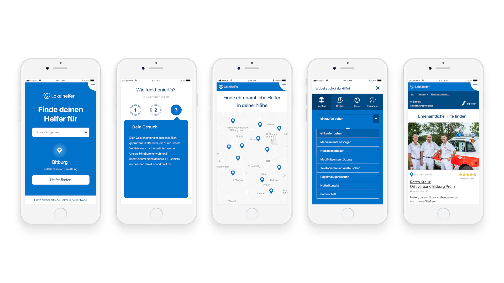
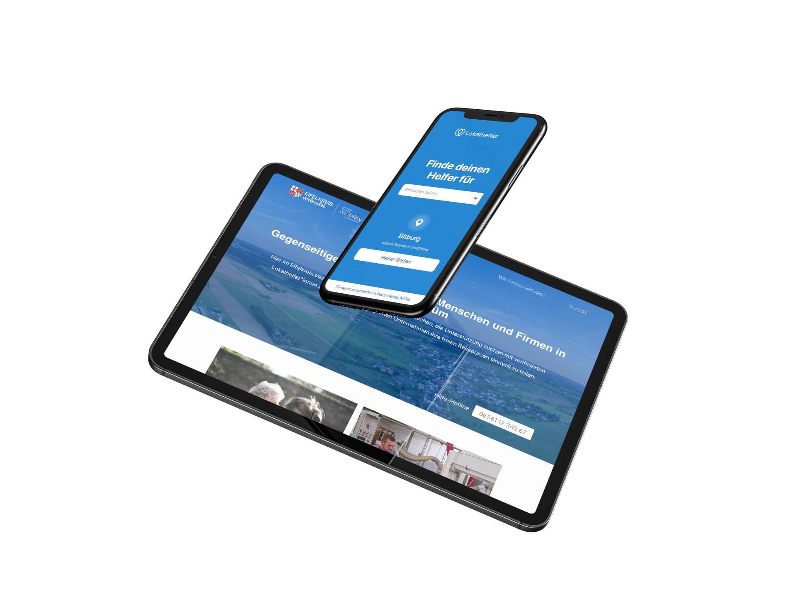

# Lokalhelfer

Lokalhelfer ist die Plattform für Nachbarschaftshilfe von nebenan.

Über die Lokalhelfer-Plattform können Personen geolokalisiert Hilfe bei bestimmten Tätigkeiten
anbieten. Personen, die wiederum Hilfe benötigen, können die Hilfsangebote über die Plattform
anfragen uns sich miteinander vernetzen.

Die Plattform bringt Menschen aus gleichen Regionen und Nachbarschaften über ein smartes,
geolokalisiertes Matchmaking zusammen.

Sowohl das Onboarding als Helfer:in sowie die Anfrage als Hilfesuchende Person sind vollständig
automatisiert und im Sinne der Barrierefreiheit leicht zu bedienen. Um das Vertrauen auf der
Plattform zu gewährleisten, kann ein individueller Freigabeprozess für Hilfsangebote aktiviert
werden, welcher die manuelle Freigabe von Hilfsangeboten über das Plattform-Backend ermöglicht.

Sowohl die angebotenen Hilfstätigkeiten sowie deren Clusterungen können individuell gestaltet
werden. Nutzer der Plattform werden Schritt für Schritt durch den Prozess geführt und können alle
Informationen selbstständig im Nachhinein über ein Benutzerkonto verwalten.



Kommunen, Länder, Städte sowie öffentliche und wohltätige Institutionen können die Lokalhelfer
Plattform nahtlos in ihre bestehenden Plattformen und Lösungen integrieren, so dass sie ein
integraler Bestandteil der digitalen Strategie sind. Diese Integrationsmöglichkeit wird durch die API-first Konzeption gewährleistet.



## Tech Stack

### Backend

- Strapi headless CMS
- Database: Postgres (Recommended), MySQL, SQLite (Development)

### Frontend

- NextJS

## Getting started

### Production (Starting point)

We provide an example docker-compose.yml which is intended as a starting point for deploying an instance of the platform.  
For an actual deployment you will need to add e.g. a load balancer/reverse proxy with TLS termination etc.

#### 1. Adjust configuration variables

```shell
cd strapi/
cp .env.example .env
cd frontend/
cp .env.example .env
```

Now make changes to the .env-file as needed. Make sure to at least change the database passwords etc.

#### 2. Build & Start docker images

Now the docker images need to be build and started:

```shell
docker-compose build --pull
docker-compose up -d
```

#### 3. Access Strapi and configure

Open http://localhost:1337 and configure first admin user.  
The frontend can be accessed on http://localhost:3000.

### Development

#### Start strapi backend

By default the strapi backend is using SQLite as a DB.
It's recommended to use Postgres or MySQL for production instances.

```shell
cd strapi
yarn dev
```

#### Start the frontend

```shell
cd frontend
yarn dev
```
